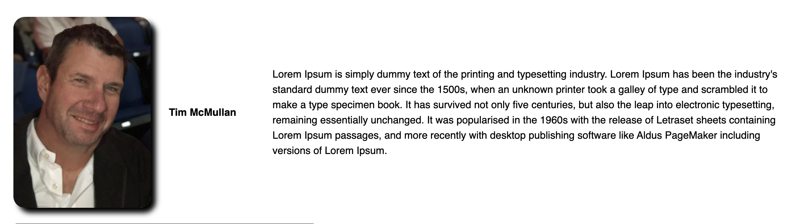
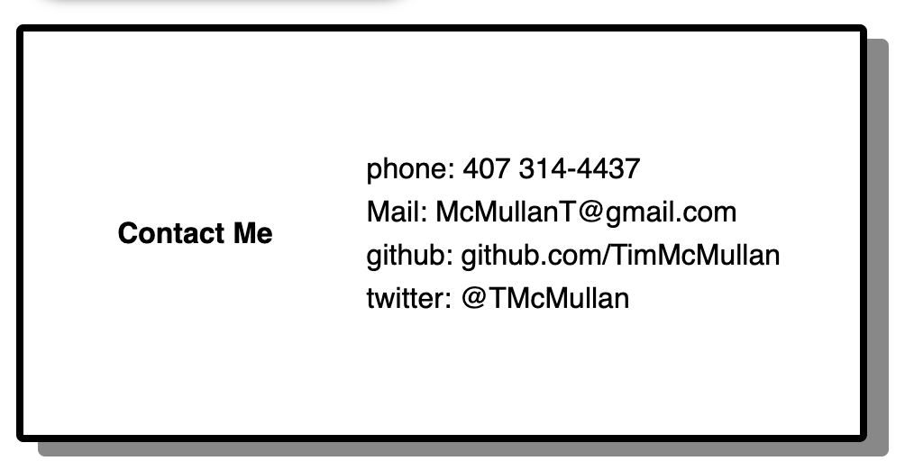
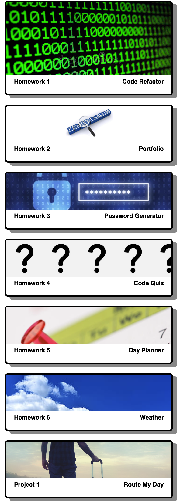

# HW_02_portfoio
UCF bootcamp portfolio project

As a user, I expect to see a page showcasing the author
As a user, I expect to see a picture, contact information, and links to the author's works
As a user, I expect to be able to experience one of the author's works by clicking on the image representing the work

# Expected Behavior

The visitor should be able to have an information page quickly load.  A nice header with a navigation bar should be prominant on the page.  I should be able to find out more about the author by seeing his picture and viewing his previous efforts.  I should be able to go to sites showing previous works by clicking on the images representative of those works.

# Assets

Class, classmates, TAs and instructor, along with expereince and allocating time to focus on the project

# Features of the project

Start at the top with an eye-catching header!

See what you want to see quickly with the navigation controls.

Learn more about the author.

Here's how you contact the author.

Sample works from the designer.

